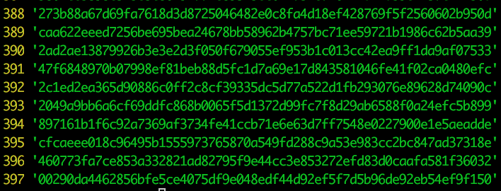
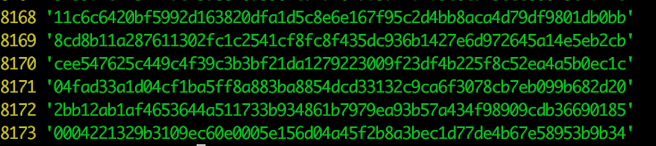
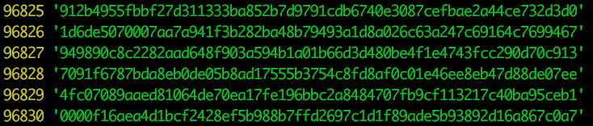
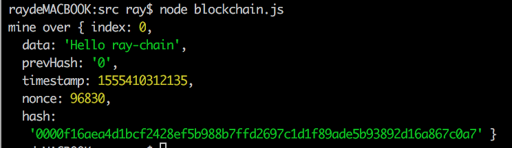

# Create Blockchain using Nodejs


## mine function

to make hash smaller

```js
mine() {
        let nonce = 0
        const index = 0
        const data = "Hello ray-chain"
        const prevHash = '0'
        let timestamp = 1555410312135
        let hash = this.computeHash(index, prevHash, timestamp, data, nonce)
        while (hash.slice(0, 2) != '00') {
            nonce += 1
            hash = this.computeHash(index, prevHash, timestamp, data, nonce)
        }
}
```

In this code snippet, we limit the first two digits should be ‘0’, which needs 397 computations




To limit the first 3 digits should be ‘0’, the number of computation is 8173


When increase to 4, the number increase to 96830

 

## genesis block

Using mine() function to generate a genesis block (difficulty = 4 in this context, we want the first 4 digits of the hash should be '0')

```js
 mine() {
        let nonce = 0
        const index = 0
        const data = "Hello ray-chain"
        const prevHash = '0'
        let timestamp = 1555410312135
        let hash = this.computeHash(index, prevHash, timestamp, data, nonce)
        // difficulty = 4 in this context, we want the first 4 digits of the hash should be '0'
        while (hash.slice(0, this.difficulty) != '0'.repeat(this.difficulty)) {
            nonce += 1
            hash = this.computeHash(index, prevHash, timestamp, data, nonce)
        }
        console.log('mine over', {
            index,
            data,
            prevHash,
            timestamp,
            nonce,
            hash
        })
    }
```

the detail of genesis block shows below:



