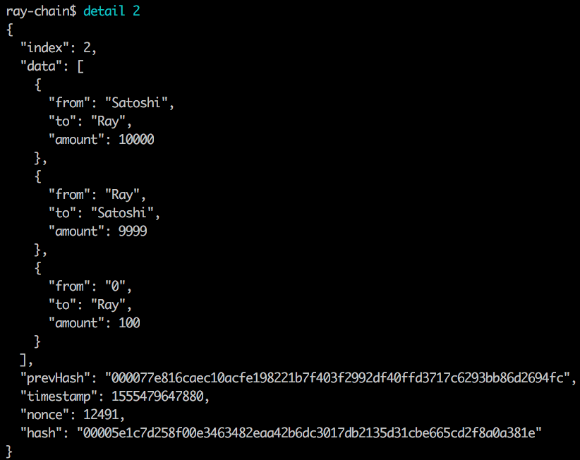

# 1 Create Blockchain using Nodejs


## 1.1 block structure

A block is composed of 'index', 'data'(transaction), 'previousHash', 'timestamp',  'nonce'(a random seed used for mining), 'currentHash'

```
block structure={
 'index',

 'data'(transaction),

 'previousHash',

 'timestamp', 

 'nonce'(a random seed used for mining),

 'currentHash',
}
```

So, a valid block will be like this:


## 1.2 compute hash

using 'sha256' (Secure Hash Algorithm 256-bit) to generate hash.

```js
computeHash(index, prevHash, timestamp, data, nonce) {
        return crypto
            .createHash('sha256')
            .update(index + prevHash + timestamp + data + nonce)
            .digest('hex')
    }
```


## 1.3 generate a new block 

to make hash smaller, needs keep computing hash until the first 4 digits of hash are all '0'

```js
generateNewBlock() {
        let nonce = 0
        const index = 0
        const data = "Hello ray-chain"
        const prevHash = '0'
        let timestamp = 1555410312135
        let hash = this.computeHash(index, prevHash, timestamp, data, nonce)
        while (hash.slice(0, 2) != '00') {
            nonce += 1
            hash = this.computeHash(index, prevHash, timestamp, data, nonce)
        }
}
```

In this code snippet, we limit the first two digits should be ‘0’, which needs 397 computations


To limit the first 3 digits should be ‘0’, the number of computation is 8173


When increase to 4, the number increase to 96830


 

## 1.4 genesis block

Using generateNewBlock() function to generate a genesis block (difficulty = 4 in this context, we want the first 4 digits of the hash should be '0')

```js
 generateNewBlock() {
        let nonce = 0
        const index = 0
        const data = "Hello ray-chain"
        const prevHash = '0'
        let timestamp = 1555410312135
        let hash = this.computeHash(index, prevHash, timestamp, data, nonce)
        // difficulty = 4 in this context, we want the first 4 digits of the hash should be '0'
        while (hash.slice(0, this.difficulty) != '0'.repeat(this.difficulty)) {
            nonce += 1
            hash = this.computeHash(index, prevHash, timestamp, data, nonce)
        }
        console.log('mine over', {
            index,
            data,
            prevHash,
            timestamp,
            nonce,
            hash
        })
    }
```

the detail of genesis block shows below:


so, we initialize the genesis block

```js
// use generateNewBlock() function to generate a genesis block
const genesisBlock = {
    index: 0,
    data: 'Hello ray-chain',
    prevHash: '0',
    timestamp: 1555410312135,
    nonce: 96830,
    hash: '0000f16aea4d1bcf2428ef5b988b7ffd2697c1d1f89ade5b93892d16a867c0a7'
}
```


## 1.5 check if block is valid

After generating a new block, to check this newly generated block is valid or not

requirements to meet:

1. index == index of last block + 1 

2. timestamp > timestamp of last block

3. prevHash ==  hash of last block

4. comply with difficulty requirement (the first 4 digits should be '0')
5. hash == recompute the hash of the block

```js

    //check newly generated block is valid
    isValidBlock(newBlock, lastBlock = this.getLastBlock()) {
        /*
        Check
          1. index == index of last block + 1 
          2. timestamp > timestamp of last block
          3. prevHash ==  hash of last block
          4. comply with difficulty requirement (the first 4 digits should be '0')
          5. hash == recompute the hash of the block
         */

        if (newBlock.index !== lastBlock.index + 1) {
            return false
        } else if (newBlock.timestamp <= lastBlock.timestamp) {
            return false
        } else if (newBlock.prevHash !== lastBlock.hash) {
            return false
        } else if (newBlock.hash.slice(0, this.difficulty) !== '0'.repeat(this.difficulty)) {
            return false
        }else if(newBlock.hash!==this.computeBlockHash(newBlock)){ //everytime you check the block, should recompute the hash and compare it with the original hash
            return false
        }

        return true
    }
```


Once confirm that the new block is valid, it will be added to the chain


## 1.6 check if the chain is valid

Check if the newly updated blockchain is valid, avoid being tampered

```js
//check if the newly updated blockchain is valid, avoid being tampered
    isValidChain(chain = this.blockchain) {
        //compare every single block with previous block using isValidBlock() function
        for (let i = chain.length - 1; i >= 1; i--) {
            if(!this.isValidBlock(chain[i],chain[i-1])){
                console.log('Invalid chain!')
                return false
            }
        }

        //simply compare the first block with genesis block
        if(JSON.stringify(chain[0])!==JSON.stringify(genesisBlock)){
            return false
        }
        
        return true
    }
```


Try to tamper the hash of block[1]

```js
let bc = new Blockchain()
bc.mine()
bc.blockchain[1].hash = '2000000' // try to tamper the hash of block[1]
bc.mine()
console.log(bc.blockchain)
```

Before adding block[2] to the chain, it will check if the whole chain is valid or not. because block[1] has been tampered, the newly generated block[2] will not be added to the chain.


## 1.7 build interactive CLI for blockchain using 'Vorpal'

> Vorpal is Node's first framework for building interactive CLI applications. With a simple and powerful API, Vorpal opens the door to a new breed of rich, immersive CLI environments. 
>
> [Vorpal in NPM]: https://www.npmjs.com/package/vorpal#introduction

Currently, the CLI only has 'print whole chain' & 'Mine' function.

```js
const vorpal = require('vorpal')()
const Blockchain = require('./Blockchain') 
const blockchain = new Blockchain()

//when users type in 'chain', they will get the whole chain
vorpal
    .command('chain', 'display the whole chain')
    .action(function (args, callback) {
        this.log(blockchain.blockchain)
        callback()
    })

//when users type in 'mine', it will do mining and show the newly generated block
vorpal
    .command('mine', 'mining')
    .action(function (args, callback) {
        const newBlock=blockchain.mine()
        if(newBlock){
            console.log(newBlock)
        }
        callback()
    })

//welcome message & show help instructions
console.log('Welcome to ray-chain!')
vorpal.exec('help')

//customize delimeter
vorpal
    .delimiter('ray-chain$')
    .show()
```


## 1.8 format data into table using 'cli-table'

> This utility allows you to render unicode-aided tables on the command line from your node.js scripts.

```js
/* 
data structure will be like
[
    {index:0,data:'hello world'...},
    {index:1,data:'hello NodeJs'...},
]
*/
// format data into table
function formatLog(data){
    if(!Array.isArray(data)){
        data=[data]
    }
    const firstObject=data[0]
    head=Object.keys(firstObject)
    const table=new Table({
        head:head,
        colWidths:new Array(head.length).fill(15)
    })

    //tricky one, but very concise! Important!
    const res=data.map(obj=>{
        return head.map(key=>obj[key])
    })

    // spread operator
    table.push(...res)
    console.log(table.toString())
}
```


## 1.9 simple transaction 

1. simple transaction of 'A' transfering the 'amount' to 'B' 
2. genesisBlock will give miner 100 ray-coins(JUST FOR FUN) as reward for mining, which should also be recorded in the transaction

```js
//simple transfer function
transfer(from, to, amount) {
        const tranObj = { from, to, amount }
        this.data.push(tranObj) 
        return tranObj
    }

//every time genesisBlock will give miner 100 coins as reward, which also be recorded in the transaction
mine(address) {
        //give miner reward of 100 ray-coins
        this.transfer('0', address, 100)

        const newBlock = this.generateNewBlock()
        ...
    }
```

For exmaple, there are two transactions:

- Satoshi transfered Ray 10000 ray-coins
- Ray transfered Satoshi 9999 ray-coins


And after a miner write these two transactions into a block, he will be rewarded 100 ray-coins, which should be recorded in the block. So, the details of the block show below:




## 1.10 calculate balance

go through every block-> every transaction to calculate

```js
//calculate balance: go through every block-> every transaction to calculate
    balance(address){
        let balance=0
        this.blockchain.forEach(block=>{
            // if it is genesis block, return
            if(!Array.isArray(block.data)) return

            block.data.forEach(trans=>{
                if(trans.from===address){
                    balance-=trans.amount
                }else if(trans.to===address){
                    balance+=trans.amount
                }
            })
        })
        return balance
    }


// also, every time you transfer, need to check if balance is enough
transfer(from, to, amount) {
        // if 'from' is genesis block, don't have to check
        if(from!=='0'){
            let balance=this.balance(from)
            if(balance<amount){
                console.log("Not enough balance! Sorry!")
                return
            }
        }
...
}
```

  Ray get 100 coins for initial minging(balance=100) -> Ray transfer 99 coins to Satoshi (balance=1) -> Ray get another 100 coins for mining again(balance=101)


## 1.11 RSA encryption

1.check wallet.json file, if exists, read keys from json file and check consistency

2.if doesn't exist wallet.json file, create both public and private key

```js
function generateKeys() {
    const fileName = './ray-wallet.json'
    try {
        let res=JSON.parse(fs.readFileSync(fileName))
        if(res.prv&&res.pub&&getPub(res.prv)===res.pub){
            keypair=ec.keyFromPrivate(res.prv)
            return res
        }else{
            // throw new Error('key in json not valid')
        }
    } catch (error) {
        let res = {
            prv: keypair.getPrivate('hex').toString(),
            pub: keypair.getPublic('hex').toString(),
        }
        fs.writeFileSync(fileName,JSON.stringify(res))
        return res
    }
}
```

use transaction+private key to generate signature

```js
function sign({from,to,amount}){
    const bufferMsg=Buffer.from(`${from}-${to}-${amount}`)
    let signature=Buffer.from(keypair.sign(bufferMsg).toDER()).toString('hex')
    return signature
}
```

verify using transaction + signature + public key

```js
function verify({from,to,amount,signature},pub){
    const keypairTemp=ec.keyFromPublic(pub,'hex')
    const bufferMsg=Buffer.from(`${from}-${to}-${amount}`)
    return keypairTemp.verify(bufferMsg,signature)
}
```

using transactions to test:

```js
let keys=generateKeys()

const trans={from:'Ray',to:'Satoshi',amount:1000}
const trans2={from:'Ray',to:'Satoshi',amount:199}
const signature=sign(trans)
trans.signature=signature
trans2.signature=signature
let isVerified1=verify(trans,keys.pub)
let isVerified2=verify(trans2,keys.pub)
console.log('verify transaction1:',isVerified1)
console.log('verify transaction2:',isVerified2)
```

